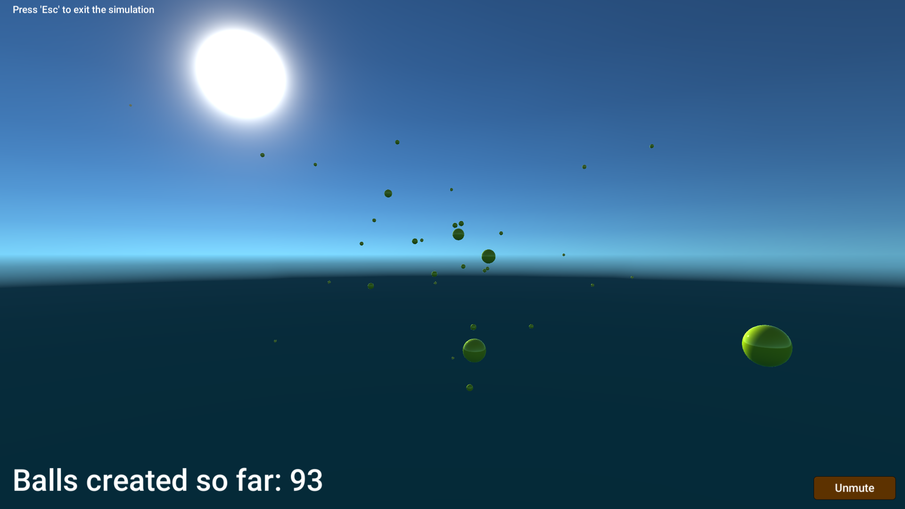

# GravityBalls

Simple gravity simulation in Unity - it uses Newtonian physics scaled so that G = 66.7. The simulation runs as follows:
  * Every quarter of a second a ball is created randomly inside camera view
  * Each ball has it's own gravity fields and attracts others
  * Upon collision more massive or faster ball absorbs the other one and grows (it's surface area is increased by absorbed ball's surface area and it's mass is added)
  * When a ball reaches 50x it's initial mass, it explodes into as many smaller balls as it has devoured over its lifetime
  * When the ball counter reaches 250, gravity gets reversed and the balls start to repel each other - they expand and are slowly halted by air drag
  * No other forces act upon the balls

It's basicaly N-body simulation. The simulation contains Audio Manager script and a simple UI.

## Possible improvements

 * Optimising simulation by some sort of spatial compartmentalisation or delegating calculations to compute shader.
 * Sound is kinda glitchy at the moment and obnoxious but the mute button works which is nice. Possible solution: creating separate object for each type of sound.

